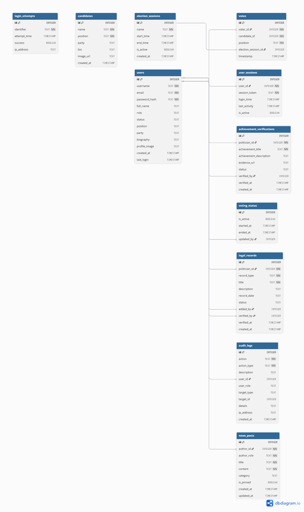

# Architecture Diagram

## System Architecture Overview




## Folder Structure

```
CCCS106-FinalProject/
├── main.py                 # Application entry point
├── setup_db.py             # Database initialization
├── requirements.txt        # Python dependencies
├── voting_app.db           # SQLite database file
│
├── app/                    # Main application code
│   ├── __init__.py
│   ├── views/              # Page/View components
│   │   ├── login_page.py
│   │   ├── signup_page.py
│   │   ├── home_page.py
│   │   ├── profile_page.py
│   │   ├── settings_page.py
│   │   ├── comelec_dashboard.py
│   │   ├── nbi_dashboard.py
│   │   ├── audit_logs_page.py
│   │   └── analytics_page.py
│   │
│   ├── components/         # Reusable UI components
│   │   ├── sidebar.py
│   │   ├── top_taskbar.py
│   │   ├── post_card.py
│   │   ├── post_container.py
│   │   ├── charts.py
│   │   └── ...
│   │
│   ├── services/           # Business logic services
│   │   └── ai_service.py   # AI-powered analysis
│   │
│   ├── state/              # Application state management
│   │   └── session_manager.py
│   │
│   └── storage/            # Data persistence
│       └── database.py
│
├── tests/                  # Test suite
│   ├── test_ai_service.py
│   ├── test_database.py
│   ├── test_session_manager.py
│   ├── test_voting_integration.py
│   └── test_audit_integration.py
│
├── assets/                 # Static assets
│   └── images/
│
└── docs/                   # Documentation
    └── *.md
```

## Technology Stack

### Frontend/UI Layer
| Technology | Description |
|------------|-------------|
| **Flet** | Python-based UI framework built on Flutter |
| Material Design | Modern, responsive UI components |
| Cross-platform | Runs on Windows, macOS, and Linux |

### Backend Layer
| Technology | Purpose |
|------------|----------|
| **Python 3.11+** | Core programming language |
| SQLite | Lightweight database engine |
| bcrypt | Secure password hashing |
| hashlib | SHA-256 for data integrity |
| UUID | Session token generation |

### Emerging Technology
| Technology | Purpose |
|------------|----------|
| **Rule-Based AI** | Candidate analysis and matching |
| NLP-like Analysis | Theme and sentiment extraction |
| Keyword Matching | Policy area identification |
| Scoring Algorithms | Compatibility calculations |

### Data Visualization
| Component | Description |
|-----------|-------------|
| Custom Charts | Built with Flet Canvas |
| Bar Charts | Vote distribution display |
| Donut Charts | Percentage breakdowns |
| Stat Cards | Quick metrics display |

### Testing
| Tool | Purpose |
|------|----------|
| pytest | Test framework |
| unittest | Python standard testing |
| mock | Dependency mocking |

## Data Flow

### Request Flow
1. **User Action** - User interacts with the application (click, form submission)
2. **Flet UI Layer** - Captures the event and validates input
3. **Service Layer** - Processes business logic and orchestrates operations
4. **Database Layer** - Persists or retrieves data from SQLite

### AI Integration Flow
1. **Service Layer** sends candidate/voter data to **AI Service**
2. **AI Service** performs theme extraction, sentiment analysis, and compatibility scoring
3. Results are returned to the Service Layer for display

### Response Flow
1. **Database Layer** returns query results
2. **Service Layer** combines data with AI insights
3. **Flet UI Layer** renders updated UI, analytics, and recommendations
4. **User** sees the response (candidate cards, charts, recommendations)

---

*Document Version: 1.0*  
*Last Updated: December 2025*
